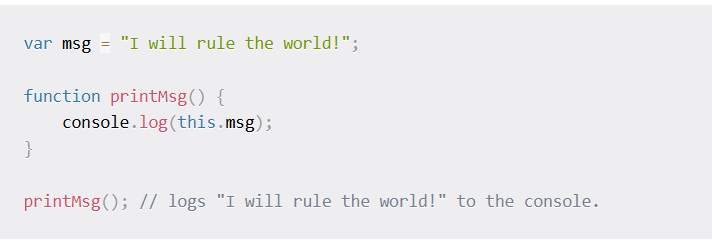
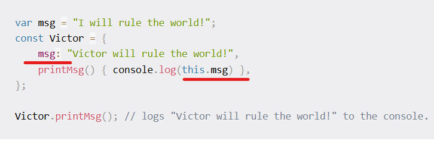
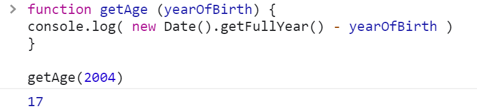
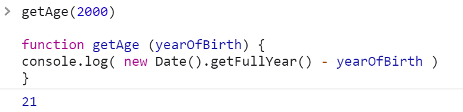

# Como funciona o
## <!-- fit --> javascript 
## nos bastidores

> por Lucas Freitas

---


#  COMO EXECUTAR JAVASCRIPT 

 


<!-- 
- Todo código JavaScript precisa ser hospedado e executado em *algum* tipo de ambiente. Na maioria dos casos, esse ambiente seria um navegador **web**. 
-->

---

> JAVASCRIPT no

# <!-- fit --> Navegador


<!-- 
  Entender o conceito de execução do javascript é essesncial para escrever codigos eficientes e livres de erros. Isso nos ajudará a entender escopo, hoisting, a palavra `this` entre outros conceitos importantes da linguagem.

  Nessa apresentação iremos navegar até as profundezas dos navegadores para desconbrir como  o javascript funciona.
-->

---


#  Conceitos 


---


# <!-- fit--> Parser


<!-- 

o Parser ou Analisador

é um programa que lê o programa, linha-por-linha. Entende como o codigo se encaixa com a sintaxe que foi definida pela linguagem de programação e o que é esperado que o codigo faça;
-->

___


# <!-- fit--> Motor

<p>

  
  
  

</p>


<!-- 

o Motor

cada navegadores possui um mecanismo. Como por exemplo: o **mecanismo V8** para Google Chrome, **SpiderMonkey** para Firefox e **Chakra** para Internet Explorer. Mas todos eles seguem um padrão que e o **ECMAScript**. Padrão esse que garante que o mesmo codigo poderá ser executado em diferentes motores!

-->

___


# <!-- fit--> Context

```
1. o código específico é analisado 
2. as variáveis e funções são armazenadas na memória 
3. o código de bytes executável é gerado 
4. e finalmente executado,
```


<!-- 

o Contexto


- Durante o tempo de execução o Contexto de Execução segue os seguintes passos:

1. o código específico é analisado, 
2. as variáveis e funções são armazenadas na memória, 
3. o código de bytes executável é gerado e 
4. e finalmente executado,


-->

___


# GEC e FEC
## (global e função)


<!--

Exitem dois tipos de "analizadores": GEC e FEC

- O Contexto de Execução Global (GEC) e o Contexto de Execução de Função (FEC) são fundamentais para a estruturação e execução do código JavaScript. O GEC é único e global, enquanto o FEC é criado e destruído cada vez que uma função é chamada. Compreender essas diferenças é crucial para escrever e depurar código JavaScript de forma eficaz.

-->

---

# GEC



<!-- 

Sempre que o mecanismo JavaScript recebe um arquivo de script, ele primeiro cria um Contexto de Execução padrão conhecido como Contexto de Execução Global (GEC).

O GEC é o contexto de execução base/padrão onde todo o código JavaScript que não está dentro de uma função é executado.

Para cada arquivo JavaScript, só pode haver um GEC.
-->

---

# FEC




<!-- 

Sempre que uma função é chamada, o mecanismo JavaScript cria um tipo diferente de Contexto de Execução conhecido como Contexto de Execução de Função (FEC) dentro do GEC para avaliar e executar o código dentro dessa função.

Como cada chamada de função recebe seu próprio FEC, pode haver mais de um FEC no tempo de execução de um script.

-->
---

# Fases 
### do Contexto de Execução

- Fase de Criação
- Fase de  Execução 

---

# Fase de
### Criação 


1. Criação um Objeto Variavel (VO)
2. Criação da cadeia de Escopo (Scope Chain)
3. Determina o Valor do `this`

---

# VO 
## Hosting




<!-- 

  
-->

---


<!-- 


 **Criação do Objeto Variável (VO)**
 - Objeto Variável (VO): E um conceito abstrato que representa o armazenamento de variáveis, declarações de função e parâmetros de função dentro de um contexto de execução.

**topico 3**

**Fases de Criação do Contexto de Execução**

1. **fase de criação**
 - Durante esta fase, o mecanismo JavaScript executa as seguintes etapas:
  
*  Cria o objeto variável.
*  configura a cadeia de escopo.
* Determina o valor de "**this**"
* declarações *Hoists* e declarações de variáveis.
- **elevação:**

* As declarações de função são adicionadas ao Objeto Variável com suas definições.
* As declarações de variáveis são adicionadas ao Objeto Variável com um valor inicial de undefined.
2. **fase de execução:**
- O mecanismo JavaScript executa o código linha por linha.
* As variáveis recebem valores e as funções são executadas à medida que o código é executado.
- exemplo:


-->


